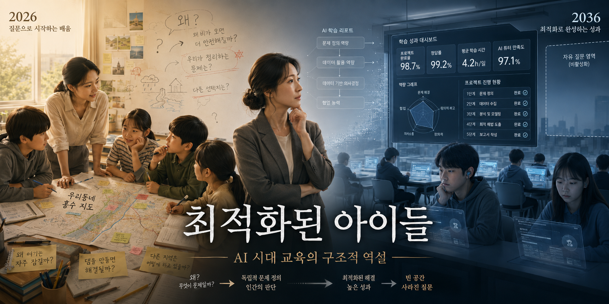
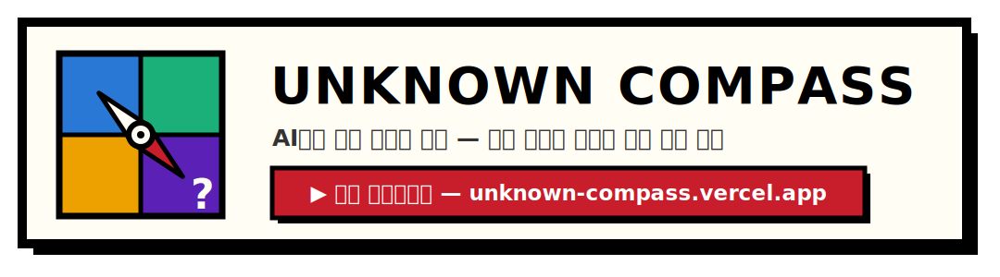

# 미래에서 온 오답노트 — 2036년, TODO 제목

> KAIST 실패연구소 **2026 AI×실패 아이디어 공모전** 참가작의 보완 자료입니다.
> 심사는 1페이지 제안서(PDF)를 중심으로 진행되며, 이 페이지는 그 제안서를
> **보완·확장**하기 위한 자료입니다 — 제안서 내용을 그대로 옮기지 않습니다.

**📄 [제안서 PDF 보기](../../releases/latest)** ・ 팀 리볼빙 (이준엽 · 조기원)

---

## 2036년의 장면

<p align="center">
  <a href="story/2036-optimized-children.md">
    
  </a>
  <br>
  <sub><strong>성과는 완벽했다. 그런데 질문이 사라졌다.</strong> 이미지를 클릭하면 2026–2036년, 어느 교사의 10년을 읽을 수 있습니다.</sub>
</p>

한세윤은 교직 5년 차, AI를 쓴 반과 쓰지 않은 반으로 작은 실험을 해본 교사였다.
10년 뒤 그녀의 학교는 전국에서 가장 성과가 좋은 학교가 된다 — 그리고 그 사이,
매년 충분한 이유가 있었던 선택들이 하나씩 쌓인다.

> 어느 결정도 그 자체로 잘못되었다고 말하기 어려웠다.
> 그러나 그 선택들이 10년에 걸쳐 쌓이면서 학교는 한 가지 능력을 잃어버렸다.
> (…) 2036년의 가장 두려운 사실은 실패가 발생했다는 것이 아니었다.
> **실패가 모든 지표에서 성공으로 측정되고 있었다는 사실이었다.**

**→ [전문 읽기: 《최적화된 아이들》 — 2026–2036 연대기](story/2036-optimized-children.md)**

## 우리가 놓쳤던 신호 — 인과 역추적

```
AI 지원으로 산출물 급상승
        ↓
학교·사회가 결과물과 완수율을 성공의 증거로 간주
        ↓
질문·검증·수정의 사고 과정이 평가에서 사라짐
        ↓
인간의 지적 능력을 비효율적인 비용으로 취급
        ↓
2036: 모든 성과 지표는 올랐지만, 도움 없이 남는 역량은 소멸
```

문제는 AI가 인간 평가를 단번에 무너뜨렸다는 데 있지 않습니다. AI가 만든 성과의 효용이 커질수록
학교와 사회가 **인간의 지적 능력을 덜 중요하게 취급하는 선택**을 반복했고, 그 선택이 평가 제도로
굳어진 데 있습니다. 높은 산출물은 학습의 증거가 아니지만, 우리는 둘을 구분할 과정 데이터를
만들지 않았습니다.

근거와 이 프로젝트에서 검토한 참고자료는 [`research/sources.md`](research/sources.md)에 모아두었습니다.

## 지금, 무엇을 바꿔야 할까

《최적화된 아이들》은 아래 회고 장치가 없었던 세계의 사고실험입니다. 필요한 것은 AI 사용법만
가르치는 리터러시가 아니라, AI에게 일을 맡기기 전후에 **내가 아는 것과 모르는 것을 드러내는
메타인지 리터러시**입니다.

- [ ] **학습자 — 오늘부터:** 답을 요청하기 전에 알고 있는 것·모르는 것·추정하는 것을 먼저 기록하고, 답을 받은 뒤 무엇이 바뀌었는지 회고합니다.
- [ ] **학교·교사 — 2028년까지 파일럿:** AI 튜터에 회고 단계를 내장하고, 최종 산출물보다 질문·검증·수정 과정과 AI 도움을 줄인 뒤 남는 역량을 평가합니다.
- [ ] **교육 당국·공급자 — 2027~2031년:** 메타인지 리터러시를 공교육의 보편재로 배포하고, 교육 AI의 기대효과와 장기 파급효과를 출시 전에 서술·검증합니다.

이 접근은 모델 금지나 대필 탐지보다 기술 변화에 덜 종속적입니다. 대신 prompting 기록이 감시로
변질될 위험, 교사의 검토 부담, 보편 배포 비용이 있으므로 원문 저장 최소화·교사 재량·공공 투자를
동시에 설계해야 합니다.

이 문제의식에 공감한다면, 주변에 이 페이지를 공유해 주세요.

### 직접 체험해보기 — 🧭 언노운 나침반

<p align="center">
  <a href="https://unknown-compass.vercel.app">
    
  </a>
  <br>
  <sub>대응 방안(AI 리터러시)의 프로토타입 — 설치·가입 없이 브라우저에서 바로 진단.
  API 키가 없어도 <a href="https://unknown-compass.vercel.app/#demo">#demo</a>로 예시를 볼 수 있습니다.</sub>
</p>

---

## 이 저장소에 대하여

제안서를 완성하기까지의 협업 과정(리서치 → 회의 → 초안 → 서사 → 프로토타입)을 아래에서 직접 확인하실 수 있습니다!

| 경로 | 내용 |
|------|------|
| 📄 [`proposal/`](proposal/) | 제안서 Typst 소스 (`proposal.typ`) |
| 📖 [`story/`](story/2036-optimized-children.md) | 《최적화된 아이들》 — 1번 문항(예견된 실패)을 확장한 2026–2036 연대기 |
| 🔍 [`research/`](research/) | 리서치·근거 자료 |
| 🗓 [`research/meetings/`](research/meetings/) | 팀 회의 요약 — 회의별 논의·결정 사항 |
| 🧭 [`tool/`](tool/) | **언노운 나침반** 프로토타입 · [라이브 데모 ↗](https://unknown-compass.vercel.app) |
| 📦 [Releases](../../releases) | 확정 제안서 PDF |
