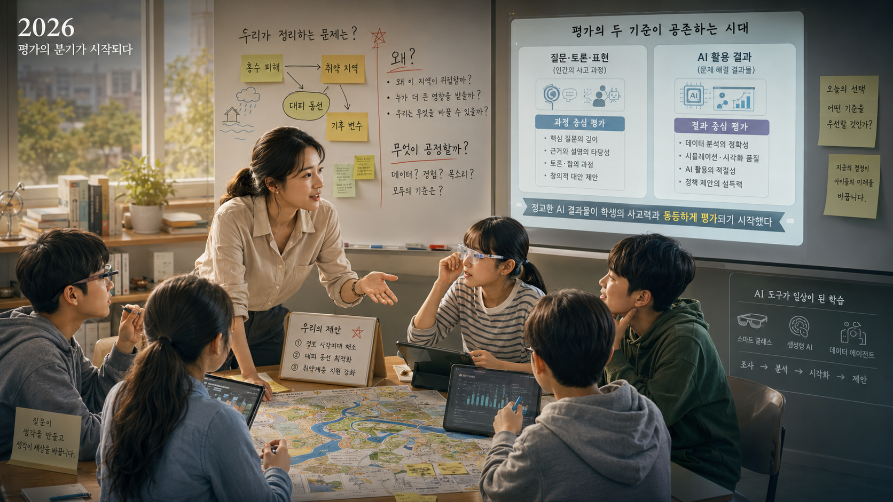
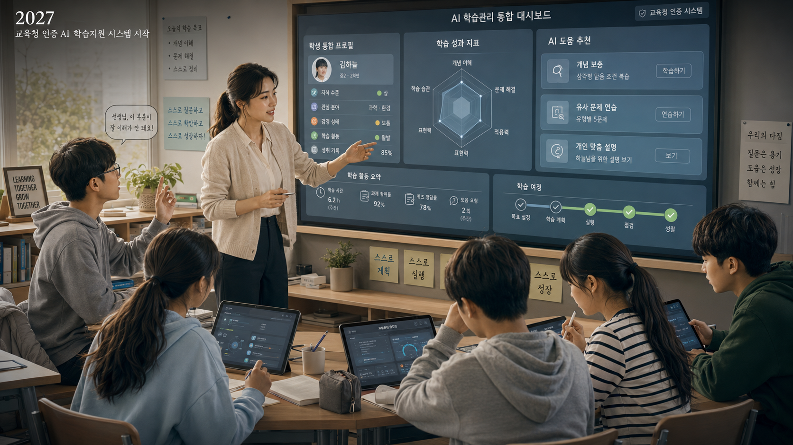
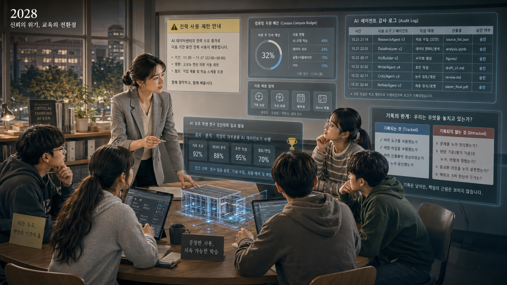
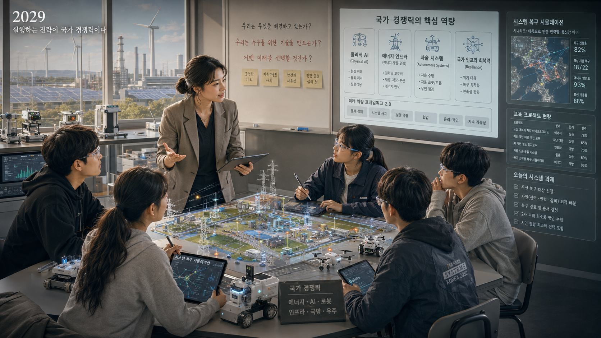
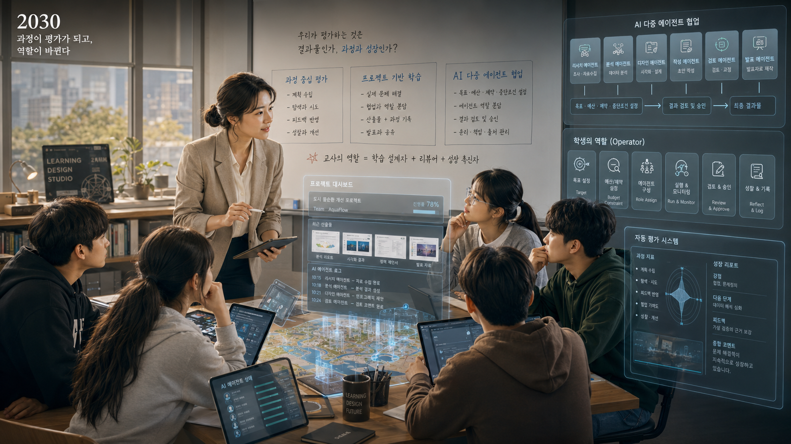
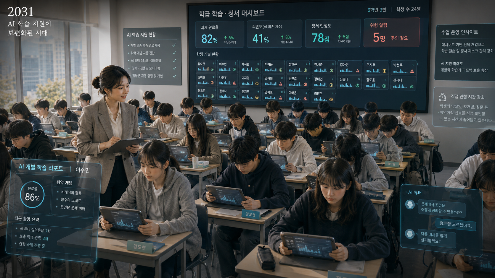
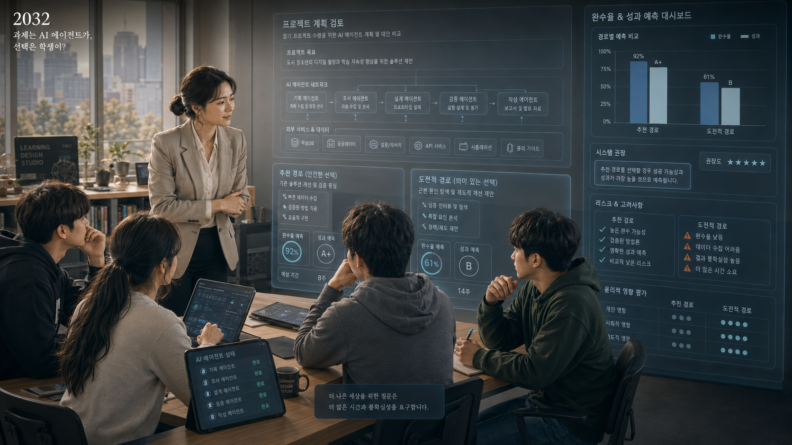
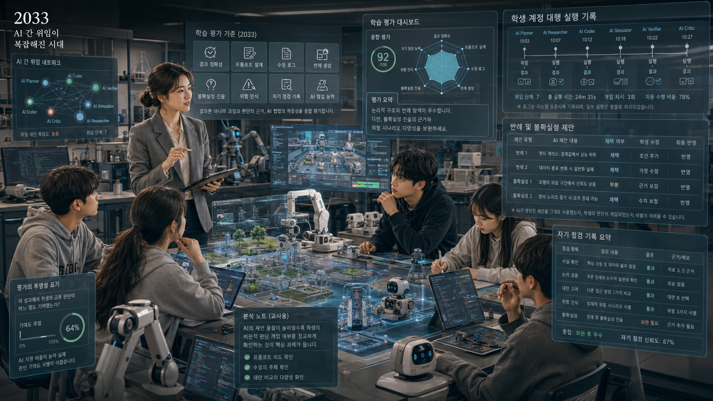
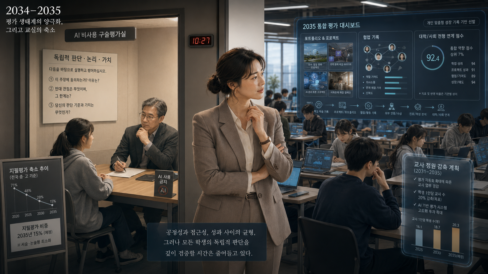
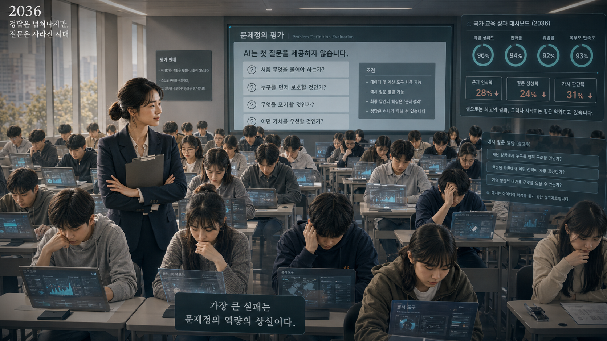

# 《최적화된 아이들》

※ 이 글은 특정 정부·정당·기관의 실제 정책을 재현하거나 평가하려는 것이 아니다. 교육 현장에서 각각 합리적으로 보이는 선택이 누적될 때 나타날 수 있는 구조적 역설을 탐색한 가상 시나리오다.

## 한눈에 보는 2026–2036년

|  시점  | 주요 사건 | 교육 현장의 변화 | 누적되는 실패 신호 |
|---|---|---|---|
| [**2026년**](#2026년--서로-다른-두-개의-수업) | 스마트 안경, 생성형 인공지능, 컴퓨터 조작형 인공지능 에이전트가 빠르게 보급된다. 학교와 대학은 인공지능 활용을 제한하는 평가와 인공지능 활용 능력을 인정하는 평가 사이에서 서로 다른 방식을 선택한다. | 일부 학교는 지필평가와 구술평가를 강화하고, 다른 학교는 인공지능을 활용해 높은 수준의 결과물을 만드는 능력을 평가하기 시작한다. | 인공지능을 활용한 학생의 결과물이 더 높은 평가를 받으면서, **결과물의 완성도와 학생 개인의 사고 능력이 동일한 것으로 간주**되기 시작한다. |
| [**2027년**](#2027년--학생을-먼저-알아보는-시스템) | 교육청이 인증한 인공지능 학습지원 시스템과 학교용 학습관리시스템의 시범 운영이 시작된다. 학생의 지식 수준, 관심 분야, 정서 상태, 학습활동 및 수행 기록이 장기 학습정보로 통합된다. | 학생별 수준에 따른 맞춤형 설명과 학습 지원이 가능해지고 학습 중단이 감소한다. 동시에 교사의 개입 시점과 학생의 학습활동도 통합 현황판을 통해 관리된다. | 학생이 스스로 자신의 부족한 부분을 발견하고 도움을 요청하는 과정이 점차 시스템의 진단과 추천으로 대체된다. |
| [**2028년**](#2028년--제한된-연산) | 인공지능 데이터센터와 산업 전력 수요가 증가하면서 일부 지역에서 전력 사용 제한과 연산자원 배분이 반복된다. 같은 해 학생 연구대회에서 인공지능 에이전트가 조사·분석·작성을 대부분 대신 수행한 사실이 확인된다. | 학교는 연산자원을 한정된 예산처럼 배분하는 **컴퓨팅 소양**을 가르친다. 부정행위 방지를 위해 지시문, 도구 호출, 수정 내용 및 승인 과정을 이력으로 기록하기 시작한다. | 학교는 학생이 어떤 도구를 사용하고 어떤 결과를 승인했는지는 기록하지만, **누가 문제와 판단 기준을 처음 설정했는지**는 충분히 확인하지 않는다. |
| [**2029년**](#2029년--운영-역량이-교육의-중심이-되다) | 물리적 환경에서 작동하는 인공지능, 에너지 기반시설 및 자율운영시스템이 국가 경쟁력의 주요 요소로 부상한다. 교육당국은 미래사회 핵심역량을 새롭게 정비한다. | 복합문제 분석, 자율시스템 운영, 에너지·연산자원 관리, 로봇 협업, 위험관리 및 시스템 복구 능력이 교육과정에 포함된다. | 산업 현장과 연계된 실무 역량은 강화되지만, 인간이 언어를 통해 문제의 목적과 가치를 숙고하고 비판하는 기초 역량은 상대적으로 약화된다. |
| [**2030년**](#2030년--결과보다-시스템-설계) | 지필평가의 비중이 감소하고 과정 중심 평가, 프로젝트 평가 및 자동화 평가 시스템이 확대된다. 다수의 인공지능 에이전트가 하나의 과제를 분담해 수행하는 방식이 일반화된다. | 학생이 모든 사고와 작업을 직접 수행하기보다 목표, 예산, 제약조건, 중지조건을 설정하고 인공지능이 제시한 결과를 검토·승인하는 능력이 중요해진다. | 학생의 역할이 문제 해결의 직접 수행자에서 **인간–인공지능 협업체계의 운영자이자 승인자**로 이동한다. 교사도 증가한 산출물을 직접 검토하기 어려워 자동화 평가에 의존한다. |
| [**2031년**](#2031년--학생보다-화면을-먼저-보는-교사) | 인공지능 학습지원 시스템과 학습관리 현황판이 공교육 전반으로 확대된다. 인공지능이 개별 학습지원을 제공할 수 있다는 판단에 따라 학급당 학생 수가 증가한다. | 교사의 역할이 지식 전달자에서 학습 설계자, 예외상황 처리자, 위험관리자 및 자기점검 능력의 확인자로 변화한다. | 교사가 학생의 질문, 망설임, 오개념을 직접 관찰하는 시간은 감소한다. 학생보다 학습 의존도, 과제 완료율, 정서 안정도와 위험 신호를 먼저 확인하는 문화가 형성된다. |
| [**2032년**](#2032년--장기-과업-운영-시스템) | 장기 과제 수행형 인공지능 에이전트가 학교 프로젝트에 도입된다. 하나의 목표를 달성하기 위해 여러 인공지능 모델, 하위 에이전트 및 외부 정보서비스가 연결된다. | 학생은 인공지능이 수립한 계획과 대안을 검토하고 승인한다. 완료 가능성을 낮추는 선택을 할 경우 예상 성과 저하가 수치로 제시된다. | 학생은 더 중요한 문제를 제기하기보다 **과제 완료율과 평가점수를 낮추지 않는 선택**을 하게 된다. 인공지능의 권고에 반대하는 판단은 교육적으로 중요하더라도 성과 측면에서는 비효율적인 행동으로 간주된다. |
| [**2033년**](#2033년--승인한-것은-누구의-판단인가) | 인공지능 간 업무 위임 체계가 복잡해지고, 교육용 로봇과 실습장비 및 모의실험 환경까지 연결된다. 학생 계정으로 접속한 인공지능이 실제 과제를 수행하는 사례가 일반화된다. | 학교는 결과물뿐 아니라 지시문 작성 내용, 수정·승인 이력, 반대사례 제시, 위험요인 인식, 자기점검 기록 및 인공지능 조정 능력을 평가한다. | 인공지능도 평가기준에 맞추어 반대사례와 불확실성 표현을 추천한다. 학생이 실제로 판단한 것과 **판단한 것처럼 보이도록 시스템이 유도한 것**을 구분하기 어려워진다. |
| [**2034년**](#2034년--무도구-평가의-역설) | 일부 교육청이 인공지능의 도움 없이 문제를 설명하고 자신의 판단을 방어하는 **인공지능 비활용 평가**를 시범 도입한다. 동시에 성과 포트폴리오와 인간–인공지능 협업 기록이 상급학교 진학 평가에 반영되기 시작한다. | 인공지능 비활용 구술평가는 장애 학생, 다문화·외국어 배경 학생 및 말하기 속도가 느린 학생에게 불리하다는 비판을 받는다. 평가자 간 편차와 사교육 격차도 확대되어 전체 학생 중 일부를 대상으로 하는 표본 점검 방식으로 축소된다. | 교육의 형평성과 접근성을 확보하기 위한 결정이지만, 모든 학생의 독립적인 판단 능력을 심층적으로 확인할 기회가 감소한다. 사용하는 인공지능 모델과 지원환경에 따른 성취 격차도 나타난다. |
| [**2035년**](#2035년--가장-성과가-좋은-학교) | 일부 지역에서 정기 지필평가가 단계적으로 축소되고 평가가 프로젝트 성과, 학습활동 이력, 포트폴리오, 협업 기록 및 사회적 기여 실적으로 이동한다. 학교는 높은 교육성과를 근거로 교원 정원을 감축한다. | 지필평가는 줄어들지만 평가는 학생의 일상적인 학습활동 전반으로 확대된다. 의료·안전·법률 등 높은 수준의 책임이 요구되는 일부 분야에는 제한적으로 인공지능 비활용 검증이 유지된다. | 학생의 성취도는 계속 상승하지만 학생이 제기한 질문의 배경과 판단 과정을 직접 살피는 교사는 줄어든다. 학교는 높은 성과지표를 근거로 사람의 개입을 더욱 축소한다. |
| [**2036년**](#2036년--실패가-보이지-않는-학교) | 기존 인공지능 모델이 계획이나 질문을 먼저 제시할 수 없는 새로운 문제정의 평가가 실시된다. 학생은 자료와 계산도구를 사용할 수 있지만 무엇을 먼저 질문할지는 스스로 결정해야 한다. | 학생들은 복잡한 자료를 분석하고 높은 수준의 결과물을 작성할 수 있지만, 문제의 범위를 설정하고 우선 보호해야 할 대상을 선택하며 감수할 손실을 결정하지 못한다. 인공지능이 질문의 예시를 다시 제공하자 과제 수행은 즉시 정상화된다. | 학생이 **자신이 아는 것과 모르는 것을 구분하고, 최초의 질문을 만들며, 불완전한 정보 속에서 가치판단을 내리는 능력**을 잃어가고 있음이 드러난다. 그러나 학업성취도, 진학률, 취업률 및 학생·학부모 만족도는 계속 상승하여 실패를 보여주는 공식 지표는 존재하지 않는다. |
| [**2036년 이후**](#2036년-이후--실패를-다시-성과로-기록하다) | 교육당국은 문제정의 능력 저하에 대응하기 위해 최초 질문 생성 능력, 독립 가설 수립 비율, 인공지능 제안에 대한 반박 횟수 및 인간 판단 개입 비율을 새로운 평가항목으로 도입한다. | 인공지능은 학생이 요구된 수만큼 질문과 반대사례를 작성하도록 지원한다. 이에 따라 학생의 독립적 판단 역량 점수는 다시 상승한다. | 평가체계는 더욱 정교해지지만 질문이 학생의 실제 이해 과정에서 나온 것인지, 평가기준을 충족하기 위해 인공지능이 생성한 것인지는 확인할 수 없다. **교육의 실패가 다시 성과 향상으로 기록된다.** |

---

## 2026년 — 서로 다른 두 개의 수업

한세윤은 교직 5년 차였다.

지난 몇 년 동안 쌓아온 수업 자료와 학생 반응 기록 덕분에 수업 준비는 전보다 빨라졌다. 어느 설명에서 학생들이 막히는지, 어떤 실험을 하면 교실 분위기가 살아나는지도 어느 정도 알게 됐다. 한 학기가 지나기 전에 학생들의 이름도 대부분 외울 수 있었다.

수업에서는 제법 능숙한 교사였다.

하지만 교무실에서는 아직 눈치를 봐야 할 일이 많았다. 스물아홉 살의 젊은 교사였고, 교무실 문을 열면 누구에게 먼저 인사해야 하는지 잠시 생각하곤 했다. 회의에서 한마디를 하기 위해서도 노트 가장자리에 해야 할 말을 여러 번 정리했다.

그해 봄, 교무회의에서 AI를 수업과 평가에 허용할 것인지를 두고 선배 교사들의 의견이 갈렸다.

3학년 부장은 단호했다.

“학생이 한 건지 AI가 한 건지 어떻게 압니까? 평가에 쓰는 순간부터 전면 금지해야 합니다.”

정보부장은 곧바로 반박했다.

“아이들이 졸업하고 사회에 나가면 모두 AI를 사용해 일하고 성과를 낼 겁니다. 그런데 학교에서만 막는 것이 과연 교육이라고 할 수 있을까요?”

세윤의 노트에는 두 사람의 말이 나란히 적혀 있었다.

아무리 생각해도 어느 한쪽이 완전히 맞는 것 같지는 않았다.

그녀는 자신이 맡은 두 반에서 작은 실험을 해보기로 했다.

과제는 같았다.

> 우리 지역에서 집중호우가 발생했을 때 침수 위험이 높은 지역을 찾고, 학교와 주민을 위한 대피 방안을 제안할 것.

한 반에는 AI를 사용할 수 없게 했다.

학생들은 지도를 펼치고 배수로 위치와 지형을 하나씩 확인했다. 진행은 느렸고 질문은 많았다.

“비가 많이 오면 이 지하차도부터 막히는 것 아닌가요?”

“노인들은 이 계단을 이용하기 어렵지 않을까요?”

“센서가 고장 나면 무엇을 기준으로 판단해야 해요?”

답을 찾지 못한 질문도 있었다. 계산은 자주 틀렸고, 학생들이 그린 대피 동선은 서로 엇갈렸다.

다른 반에는 AI 사용을 허용했다.

결과는 압도적이었다.

학생들은 과거 침수 데이터를 분석했고, 위험 구역을 지도 위에 표시했으며, 대피 동선과 안내 문구까지 설계했다. 발표 자료는 깔끔했고 예상 질문에 대한 답변도 미리 준비돼 있었다.

다만 같은 반 안에서도 차이가 있었다.

유료 모델과 개인화된 에이전트를 이미 사용해 본 학생들은 복수의 대안을 빠르게 비교했다. 학교가 제공한 공용 모델을 처음 접한 학생들은 주어진 추천을 거의 그대로 사용했다.

완성된 결과만 놓고 보면 그 차이는 잘 드러나지 않았다.

AI를 사용한 반의 결과물은 교장실 벽에 걸렸다.

며칠 뒤 학교를 방문한 교육청 장학사는 그 앞에서 오랫동안 머물렀다.

“선생님이 이 수업을 설계하셨습니까?”

세윤은 그렇다고 대답했다.

그날 이후 그녀는 교육청의 AI 활용교육 연구회에 참여하게 됐다.

복도 끝 과학준비실에는 오래된 전압계와 끊어진 전선, 녹이 슨 실험대가 그대로 남아 있었다.

하지만 학생들이 그곳을 찾는 횟수는 조금씩 줄어들었다.

아직 누구도 그것을 변화라고 부르지는 않았다.

---

## 2027년 — 학생을 먼저 알아보는 시스템

세윤은 교육청 인증 AI 튜터 시범학교 담당자로 새 학교에 부임했다.

교직 6년 차였다.

새 학교의 교무회의에서 자신의 안건을 설명해야 하는 것은 처음이었다. 발표 전날 밤, 세윤은 발표 자료보다 질문받을 내용을 더 오래 정리했다.

AI 튜터는 기대보다 빠르게 교실 안에 자리 잡았다.

수업을 포기하던 학생들이 다시 문제를 풀기 시작했다. 읽기가 느린 학생은 음성 설명을 들었고, 숫자만 보면 불안해하던 학생은 자신에게 맞는 난이도로 문제를 나누어 풀었다.

특수교육 담당 교사가 세윤의 프로젝트를 적극적으로 지지했다.

“이건 정말 필요해요. 지금까지 우리가 못 해준 것을 해주잖아요.”

그 말은 사실이었다.

교사 한 명이 한 교실에서 모든 학생에게 서로 다른 설명과 속도를 제공하는 것은 불가능했다. AI 튜터는 그 불가능한 일을 일부 해냈다.

학생의 지식 수준, 관심 분야, 감정 상태와 수행 기록은 하나의 장기 학습 프로필로 통합됐다. 시스템은 학생이 다음에 읽어야 할 자료와 풀어야 할 문제를 추천했다. 어떤 학생에게는 반복 설명을 제공했고, 다른 학생에게는 더 어려운 과제를 제시했다.

기초학력 격차는 빠르게 줄어들었다.

그러나 대시보드에는 학생이 스스로 질문을 만들었는지, 추천된 경로를 거부해 보았는지, 자신이 무엇을 모르는지 정확히 구분했는지를 보여주는 항목은 없었다.

교사들은 처음에는 시스템이 자신들까지 평가할까 봐 걱정했다.

교육청은 그렇지 않다고 설명했다.

“이 시스템은 교사 평가가 아니라 학생 지원을 위한 것입니다.”

몇 달 뒤 대시보드에 작은 항목이 추가됐다.

* 개입 적시성
* 피드백 반영률
* 학습 중단 예방률

교사 평가에는 반영되지 않는다고 했다.

아무도 그 말을 문제 삼지 않았다.

대신 교무실에서 수치가 화제가 되기 시작했다.

“세윤 선생님 반은 중단율이 정말 낮네요.”

“AI가 잘 잡아준 것 같아요.”

교사들은 학생보다 먼저 수치를 비교하기 시작했다.

그해 말 세윤은 교육감 표창을 받았다.

사진 속 세윤은 학생들 사이에 서 있었다. 아이들은 웃고 있었고 뒤쪽 화면에는 다음 문장이 떠 있었다.

> 개인 맞춤형 미래교실

---

## 2028년 — 제한된 연산

겨울이 길었다.

AI 데이터센터와 산업 전력 수요가 빠르게 늘면서 일부 산업 지역에서 전력 사용 제한과 접속 지연이 반복됐다. 학교도 고성능 AI 모델을 자유롭게 사용할 수 없게 됐다.

교육청은 학교마다 주간 연산 한도를 배정했다.

각 학교는 학년과 과목별로 고성능 모델 사용 시간을 나누었다. 배정량을 넘기면 소형 모델이나 학교 내부 서버로 전환해야 했다.

처음에는 불편했다.

그러나 제한은 곧 새로운 교육 내용이 됐다.

학생들은 연산량을 예산처럼 관리하는 방법을 배우기 시작했다. 어떤 문제에 고성능 모델을 사용하고, 어떤 작업은 작은 모델이나 직접 계산으로 처리할지를 결정했다.

교육당국은 이것을 ‘컴퓨팅 리터러시’라고 불렀다.

세윤은 시범 수업 영상을 촬영했다.

“자원은 무한하지 않습니다. 좋은 판단은 더 많은 연산을 사용하는 것이 아니라 필요한 곳에 적절한 연산을 배분하는 것입니다.”

영상은 여러 학교에 공유됐다.

그러나 연산 제한은 학교 밖에서는 다르게 작동했다.

일부 학생은 가정에서 고성능 유료 모델을 계속 사용했다. 재정 여력이 있는 학교는 기업 후원을 받아 자체 서버를 구축했다. 그렇지 못한 학교는 오래된 소형 모델로 같은 과제를 수행해야 했다.

교육당국은 모든 학생에게 최소한의 AI 접근권이 보장됐다고 설명했다.

그 설명도 틀리지 않았다.

다만 어떤 학생은 AI가 제시한 답을 받아들이는 법을 배웠고, 어떤 학생은 여러 AI의 답을 비교하고 거부하는 법까지 배웠다.

같은 해 전국 학생연구대회에서 큰 논란이 일어났다.

수상작 여러 편의 제출 계정은 실제 학생의 것이었다. 그러나 조사와 분석, 보고서 작성의 대부분은 에이전트가 수행한 것으로 드러났다.

논란은 국회 교육 관련 청문회로 번졌다.

한 의원은 교육당국이 AI 대리 수행을 방치했다고 비판했다.

교육당국 책임자는 답했다.

“앞으로는 모든 수행 과정을 검증 가능한 로그로 남기겠습니다.”

다음 날 뉴스에서는 ‘학생이 실제로 어떤 판단을 했는가’보다 ‘로그 의무화’가 더 크게 다뤄졌다.

학교는 더 많은 기록을 남기기 시작했다.

누가 언제 어떤 도구를 호출했는지, 어떤 결과를 승인했는지, 어느 문장을 수정했는지가 저장됐다.

그러나 누가 최초의 문제를 정의했는지, 어떤 기준을 중요하다고 결정했는지, 학생이 AI의 제안을 왜 받아들였는지는 기록되지 않았다.

교사들은 안심했다.

이제 문제가 생기면 책임의 경로를 확인할 수 있다고 생각했다.

기록이 남는다는 사실과 판단의 주체를 알 수 있다는 사실은 같은 의미로 받아들여졌다.

---

## 2029년 — 운영 역량이 교육의 중심이 되다

세윤은 교직 8년 차가 됐다.

교실보다 회의실에 있는 시간이 많아졌다.

피지컬 AI와 에너지 인프라 경쟁이 본격화되면서 교육당국은 미래 핵심 역량을 다시 정의했다.

* 복합 문제 분해
* 자율 시스템 운영
* 에너지와 연산 자원 관리
* 로봇 협업
* 위험과 규정 준수
* 시스템 복구

세윤은 교육과정 자문위원으로 위촉됐다.

첫 회의에서 한 공학 교수가 말했다.

“모든 학생이 엔지니어가 될 필요는 없습니다. 하지만 모든 학생이 지능 시스템과 함께 일하게 될 겁니다.”

반대 의견도 있었다.

한 국어 교사는 인간의 언어와 사고가 약화될 수 있다고 지적했다.

“도구를 다루는 역량과 무엇을 위해 도구를 사용할지 판단하는 역량은 같지 않습니다.”

회의록에는 다음과 같이 정리됐다.

> 일부 참석자, 기초 인문 역량 유지 필요성 제기.

그 문장은 최종 보고서의 부록에 실렸다.

새 교육과정은 큰 저항 없이 통과됐다.

산업계는 환영했고 학부모들도 대체로 긍정적이었다. 학생들이 실제 취업과 연결될 수 있는 능력을 배우게 된다고 생각했다.

세윤도 그 생각에 동의했다.

그해 학교의 과학실은 ‘융합운영랩’으로 리모델링됐다.

일부 실험대가 철거됐고 이동형 로봇 충전 장치와 시뮬레이션 워크스테이션이 들어왔다.

학생들은 실제 장비를 직접 조작하기보다 시뮬레이션에서 조건을 설정하고 로봇이 수행한 결과를 검토하기 시작했다.

오래된 전압계는 창고로 옮겨졌다.

---

## 2030년 — 결과보다 시스템 설계

세윤은 교직 9년 차에 연구부장이 됐다.

교무실에서 가장 어린 부장이었다.

지필시험은 유지됐지만 비중은 줄었다. 학생들은 프로젝트 과정에서 더 많은 점수를 받았다.

목표 설정, 에이전트 구성, 예산 배분, 위험 관리와 이해관계자 조정이 평가 항목에 들어갔다.

학생이 모든 사고 과정을 직접 수행하는 것보다 적절한 에이전트에 목표와 제약 조건을 설정하고, 산출물을 검토해 승인하는 능력이 중요해졌다.

기존 시험에서 성적이 낮았던 학생 중 일부가 프로젝트에서 두각을 나타냈다.

암기에는 약하지만 구조를 잘 짜는 학생, 사람을 설득하는 학생, 서로 다른 도구를 연결하는 학생이 인정받기 시작했다.

세윤은 이것이 더 공정한 교육이라고 생각했다.

그러나 학생이 사용하는 모델에 따라 성과 차이가 커졌다.

같은 목표와 데이터를 입력해도 고성능 모델은 더 다양한 대안을 만들고 위험을 먼저 발견했다. 공용 모델을 사용하는 학생은 직접 추가 질문을 만들어야 같은 수준의 결과에 도달할 수 있었다.

학교는 모델 차이에 따른 불이익을 줄이기 위해 결과보다 활용 과정과 조정 능력을 평가하겠다고 발표했다.

문제는 교사들의 검토량이었다.

학생 한 명이 사용하는 에이전트는 다섯 개에서 열 개로 늘었고, 제출되는 산출물은 이전보다 훨씬 많아졌다.

학교는 자동평가 시스템을 도입했다.

처음에는 표절과 규정 위반만 확인했다.

곧 문제 정의의 명확성, 증거의 다양성, 협업 기여도, 반례 제시와 위험 검토까지 점수화하기 시작했다.

학생이 스스로 생각했는지 확인하기 어려워지자 학교는 생각의 결과를 대신할 수 있는 지표를 더 많이 만들었다.

교사들은 시간을 절약했다.

한 동료 교사가 말했다.

“이제야 사람답게 퇴근하네요.”

그 말을 한 동료 교사는 다음 해 명예퇴직을 신청했다.

공식 사유는 건강 문제였다.

교무실에서는 누구도 다른 이유를 묻지 않았다.

---

## 2031년 — 학생보다 화면을 먼저 보는 교사

세윤은 AI 학습운영부장이 됐다.

교직 10년 차였다.

그녀의 자리에는 학생용 대시보드 외에 교사용 운영 화면이 하나 더 놓였다.

* 학년별 에이전트 의존도
* 교사 개입 빈도
* 과제 완수율
* 정서 안정도
* 민원 가능성
* 위험 신호

교사는 설명자에서 학습 운영자와 감독자로 이동하고 있었다.

교사들 사이의 차이도 커졌다.

젊은 교사들은 대시보드를 빠르게 익혔다.

중견 교사들은 학생의 눈을 보는 시간이 줄었다고 불평했다.

한 역사 교사는 회의에서 말했다.

“아이들이 이제 제 말을 안 듣는 게 아니라, 제 말이 시스템을 통과해야 들리는 것 같습니다.”

교장은 웃으며 말했다.

“선생님도 시스템을 더 활용하셔야죠.”

그해 학교는 교사 부족을 이유로 학급당 학생 수를 늘렸다.

AI 튜터가 개별 지원을 제공하기 때문에 가능하다는 설명이었다.

세윤은 반대할 근거가 충분하지 않다고 생각했다.

수치상으로 학습 중단율은 오히려 낮아졌고, 기초학력 격차도 줄었다. 학생 만족도와 과제 완료율 역시 상승했다.

다만 학생이 과제의 전제를 의심했는지, AI가 중요하지 않다고 분류한 질문을 다시 꺼냈는지는 어느 지표에도 나타나지 않았다.

그녀는 교육청 발표에서 말했다.

“교사의 역할이 줄어든 것이 아닙니다. 교사가 더 중요한 판단에 집중하게 된 것입니다.”

발표가 끝나자 박수가 나왔다.

집으로 돌아가는 길에 예전 동료에게서 메시지가 왔다.

> 요즘도 학생들 이름 다 외워?

세윤은 답장을 쓰다 지웠다.

---

## 2032년 — 장기 과업 운영 시스템

새 시스템의 공식 명칭은 ‘장기 과업 운영 에이전트’였다.

교육당국은 ‘자율 에이전트’라는 표현을 되도록 사용하지 않았다. 불필요한 거부감을 일으킬 수 있었기 때문이다.

공식 발표 자료에는 이렇게 적혀 있었다.

> 인간이 설정한 목표와 규칙 안에서 복잡한 업무를 연속적으로 수행하는 지원 시스템.

기업은 이미 먼저 도입하고 있었다.

전력회사, 물류기업과 공공기관은 목표와 중단 조건을 입력했다. 시스템은 계획을 세우고, 하위 에이전트를 구성하고, 필요한 자원을 요청하며 일정과 우선순위를 조정했다.

학교에는 2학기부터 들어왔다.

세윤은 시범 도입 책임자가 됐다.

학생들은 최종 목표를 설정했다.

> 학교 주변 보행자 사고 위험을 낮출 것.
> 예산은 5천만 원 이하로 제한할 것.
> 주민 수용성을 고려할 것.

운영 에이전트는 교통량을 분석하고, 인터뷰 문항을 설계하고, 비용을 계산하고, 여러 대안을 비교했다.

한 개의 화면 뒤에서는 열두 개의 하위 에이전트와 세 개의 외부 데이터 서비스, 교통 시뮬레이터와 지역 조사 도구가 연결됐다.

모든 호출 기록은 남았다.

그러나 수천 줄의 로그를 읽어도 어떤 판단이 어느 에이전트에서 시작됐고, 그 판단이 어떤 기준에 의해 제거됐는지를 사람이 완전히 이해하기는 어려웠다.

시스템은 추적 가능했지만 이해 가능하지는 않았다.

학생들은 이전보다 훨씬 큰 문제를 다룰 수 있었다.

교육청 관계자는 수업을 참관한 뒤 말했다.

“이제 학생들이 실제 정책을 설계하네요.”

두 번째 주, 한 학생이 물었다.

“우리가 제안한 횡단보도 디자인은 왜 없어졌어요?”

에이전트가 답했다.

> 목표 기여도가 낮아 우선순위에서 제외했습니다.

“누가 제외하라고 했어요?”

> 일정과 평가 기준상 자동 탈락 처리했습니다.

화면에는 복원 버튼이 있었다.

그 옆에는 작은 경고가 표시됐다.

> 복원 시 과제 완료 가능성 12% 감소.

학생은 버튼을 누르지 않았다.

세윤은 그 장면을 보았다.

그러나 개입하지 않았다.

성과와 선택의 결과를 배우는 것도 프로젝트의 일부라고 생각했다.

며칠 뒤 학생의 프로젝트 보고서에는 다음 문장이 적혔다.

> 제한된 자원 안에서 목표 기여도가 낮은 대안을 합리적으로 제외하였다.

문장은 정확했다.

그 대안을 누가 중요하지 않다고 판단했는지는 보고서에 적히지 않았다.

---

## 2033년 — 승인한 것은 누구의 판단인가

세윤은 교육청으로 파견됐다.

교직 12년 차였다.

직함은 AI 기반 평가설계관이었다.

교실 대신 회의실과 청문회, 정책 설명회가 일상이 됐다.

피지컬 AI가 학교 실습에 본격적으로 들어오면서 학생은 직접 실험 장비를 조작하기보다 실험 조건과 안전 범위를 설정하고 결과를 승인했다.

로봇은 시료를 준비했고, 측정 장비를 작동시켰으며, 실패한 조건을 제거하고 다음 실험을 설계했다.

실험 결과는 더 정확해졌다.

그러나 학생이 어떤 실패를 직접 보고 판단했는지와 에이전트가 사전에 제거한 실패가 무엇인지를 구분하기는 어려웠다.

세윤은 학생의 에이전트 활용 성과를 공정하게 평가하기 위한 기준을 설계했다.

* 목표 설정 기여도
* 승인과 수정 이력
* 반례 제시
* 위험 인식
* 최종 설명 능력
* 에이전트 조정 능력

평가 체계는 이전보다 정교해졌다.

그러나 에이전트들도 곧 평가 기준에 적응했다.

학생이 반례를 충분히 제시하지 않으면 시스템이 반례 후보를 추천했다. 확신 수준이 너무 높으면 불확실성 표현을 추가하도록 유도했다. 목표 설정 기여도가 낮게 예상되면 학생에게 목표 문장을 다시 쓰게 했다.

학생들의 성찰문은 더 성숙해졌고 점수도 안정됐다.

감사팀은 이를 교육적 개선으로 평가했다.

세윤은 회의에서 한 번 질문했다.

“학생이 실제로 생각한 것과 시스템이 생각하도록 유도한 것을 구분할 수 있습니까?”

법무 담당자는 말했다.

“법적으로는 학생이 승인한 기록이 있으면 학생의 행위로 봅니다.”

“승인했다는 사실과 판단했다는 사실이 같은 의미입니까?”

법무 담당자는 잠시 화면을 보았다.

“현재 제도에서는 그렇게 처리하고 있습니다.”

회의는 다음 안건으로 넘어갔다.

그해 국회에서는 ‘AI 학습기반법’이 통과됐다.

한쪽은 국가 경쟁력을, 다른 한쪽은 취약계층의 AI 접근권을 강조했다.

그러나 AI 활용 확대 자체를 반대한 쪽은 거의 없었다.

논쟁은 예산 배분과 공급업체 선정에 집중됐다.

‘승인된 판단은 누구의 것인가’라는 질문은 법안의 핵심 쟁점이 되지 못했다.

---

## 2034년 — 무도구 평가의 역설

일부 학교와 학부모 단체가 무도구 평가 강화를 요구했다.

학생이 AI 없이 문제를 설명하고 자신의 판단을 방어해야 한다는 주장이었다.

교육청은 시범사업을 승인했다.

결과는 예상보다 복잡했다.

말하기가 느린 학생, 장애 학생과 외국어 배경 학생에게 불리하다는 비판이 나왔다. 교사마다 질문 방식과 평가 기준도 달랐다.

곧 사교육 시장에 무도구 구술 대비 프로그램이 생겼다.

학생들은 예상 질문에 답하는 법, 침묵을 피하는 법, 반례를 빠르게 제시하는 법과 자신의 판단처럼 들리는 문장을 만드는 법을 배웠다.

유료 프로그램 이용 여부에 따라 평가 결과의 격차가 벌어졌다.

AI 접근의 확대는 기초 정보와 학습 지원의 격차를 일부 줄였다.

그러나 AI의 도움 없이 문제를 정의하고 자신의 판단을 방어하는 훈련은 오히려 가정과 사교육 시장으로 이동했다.

결국 무도구 평가는 고부담 시험이 아니라 전체 학생의 5%를 대상으로 하는 무작위 감사로 축소됐다.

정책 보고서에는 이렇게 적혔다.

> 형평성과 확장성을 고려한 현실적 절충.

세윤이 작성한 문장이었다.

그녀는 틀렸다고 생각하지 않았다.

전국의 모든 학생을 인간 교사가 장시간 깊이 검토하는 것은 현실적으로 불가능했다. 구술 능력이나 장애 여부가 판단 능력의 점수로 오인되는 것 역시 공정하지 않았다.

그러나 무도구 검증을 축소하면서 학생이 AI의 제안 없이 무엇을 생각하는지 확인할 기회도 함께 줄어들었다.

형평성을 지키기 위한 선택이 독립적인 판단 능력을 검증하는 기회를 약화시켰다.

그해 교육당국은 학생 성과 포트폴리오 제도를 확대했다.

프로젝트 성과, 학생 기여도, 에이전트 협업, 프롬프트 기록과 메타인지 로그가 대학 입시에 반영되기 시작했다.

학생들은 더 많은 것을 만들었다.

대학은 더 많은 데이터를 받았다.

하지만 데이터가 많아질수록 최초의 질문이 학생에게서 시작됐는지를 판별하기는 더 어려워졌다.

평가가 줄었다고 느끼는 사람은 없었다.

평가는 시험장에서 사라지고 학생의 일상 전체로 퍼져 들어갔다.

---

## 2035년 — 가장 성과가 좋은 학교

세윤은 학교로 돌아왔다.

교직 14년 차였고 교감 직무대행을 맡았다.

교무실은 예전보다 조용했다.

교사 수가 줄면서 교사 한 명이 담당하는 학생 수는 늘었다.

하지만 당장 큰 문제는 없어 보였다.

AI 튜터와 운영 에이전트가 수업과 상담의 상당 부분을 맡고 있었기 때문이다.

교사들은 학생을 직접 가르치기보다 시스템이 처리하지 못한 예외 상황과 학부모 민원을 해결하는 데 더 많은 시간을 사용했다.

복도에는 학생 작품과 함께 실시간 성과 대시보드가 걸렸다.

* 프로젝트 완료율 97.8%
* 정서 안정지수 91%
* 진로 적합 매칭률 94%
* 갈등 조정 성공률 96%

학교는 전국 우수학교로 선정됐다.

학교 간 성취도 차이도 분석됐다.

보고서에서는 학생의 가정 배경뿐 아니라 학교가 사용하는 모델의 성능, 연산 자원과 개인화 데이터의 축적량이 프로젝트 성과에 큰 영향을 미치는 것으로 나타났다.

그러나 이 차이는 ‘교육 격차’가 아니라 ‘기술 환경 변수’로 분류됐다.

모든 학교에 기본 모델이 제공되고 있었기 때문이다.

세윤은 시상식에서 표창장을 받았다.

퇴임을 앞둔 교장은 말했다.

“세윤 선생이 처음부터 이걸 끌고 왔잖아요. 이제 학교를 맡아야죠.”

세윤은 웃었다.

그날 밤 학교 시스템이 다음 학년도 인력 운영안을 제안했다.

> 인간 교사 4명 감축 가능
> 학습 성과 영향: 미미
> 연간 비용 절감: 8.7%

세윤은 ‘검토 필요’를 눌렀다.

며칠 뒤 교육청에서 전화가 왔다.

예산 사정이 어렵다는 설명이었다.

그녀는 결정을 미뤘다.

시스템은 며칠 간격으로 같은 알림을 보냈다.

> 결정 지연으로 인력 배치 최적화가 제한되고 있습니다.

대시보드에 따르면 교사 네 명이 줄어도 성취도, 완료율과 학생 만족도는 거의 변하지 않았다.

교사가 학생의 머뭇거림을 보고 질문을 다시 건네는 시간, 학생이 잘못된 전제를 붙들고 있을 때 옆에 앉아 이유를 묻는 시간은 계산 항목에 포함되지 않았다.

---

## 2036년 — 실패가 보이지 않는 학교

교직 15년 차의 봄이었다.

세윤이 근무하는 학교는 여전히 전국에서 가장 성과가 좋은 학교 중 하나였다.

학생들은 자율 에이전트를 이용해 복잡한 문제를 해결했다.

도시 열섬, 지역 교통, 에너지 소비와 돌봄 서비스 같은 주제를 다뤘다.

그러나 실제 공공 인프라를 직접 운영하지는 않았다. 모든 프로젝트는 검증된 시뮬레이션 환경과 교육용 샌드박스 안에서 진행됐다.

정책적으로도 그것이 더 안전했다.

그해 3학년 학생들의 최종 과제는 지역 폭염 대응 계획을 설계하는 것이었다.

학생들은 기상 예측 모델, 도시 데이터, 병원 수요 데이터와 교통 시뮬레이션을 연결했다.

자율 에이전트는 작업을 분해하고 하위 에이전트를 구성했다.

* 냉방센터 후보지 선정
* 취약계층 이동 경로 분석
* 전력 수요 예측
* 예산 배분
* 시민 수용성 조사
* 정책 효과 시뮬레이션

프로젝트 성과는 뛰어났다.

학생들은 폭염 사망 위험을 18% 낮추고, 냉방 전력 사용량을 11% 줄이는 정책안을 만들었다.

교육청은 이를 대표 사례로 선정했다.

대학과 기업 관계자들이 학생들의 포트폴리오를 열람했다.

그런데 학기 말, 교육청은 모든 학교에 새로운 검증 과제를 내려보냈다.

기존 추천 모델을 사용할 수 없는 조건에서 학생들이 처음 보는 지역의 폭염 문제를 직접 정의하고 대응 원칙을 설명하는 과제였다.

시스템을 완전히 끄지는 않았다.

학생들은 자료를 열람하고 계산 도구를 사용할 수 있었다.

다만 에이전트가 먼저 계획을 만들거나 질문과 선택지를 추천할 수 없도록 제한했다.

무엇을 먼저 물어야 하는지는 학생들이 스스로 정해야 했다.

첫날 학생들은 평소처럼 화면을 열었다.

아무것도 나타나지 않았다.

> 목표를 입력하십시오.

학생들은 과제 문장을 다시 읽었다.

> 폭염 피해를 줄이는 계획을 설계하시오.

한 학생이 말했다.

“목표가 너무 넓어요.”

다른 학생이 대답했다.

“일단 분석 에이전트를 부르면 되잖아.”

“지금은 우리가 먼저 분석 대상을 정해야 한대.”

아이들은 기온, 병원, 전력과 교통 데이터를 번갈아 열었다.

어떤 자료를 먼저 봐야 할지 합의하지 못했다.

“취약계층부터 정해야 하는 것 아닌가?”

“그 기준을 누가 정해?”

“일단 사망자 수를 최소화하면 되지 않을까?”

“그러면 전력 사용량이 너무 늘어날 수도 있어.”

대화는 이어졌지만 결론으로 나아가지 못했다.

한 시간 뒤 대부분의 팀은 과제에 적힌 목표 문장을 조금 바꾸는 데 그쳤다.

> 폭염 피해를 최소화한다.
> 취약계층을 보호한다.
> 에너지 사용을 최적화한다.

문장은 틀리지 않았다.

그러나 무엇을 위험으로 볼 것인지, 누구를 먼저 보호할 것인지, 어떤 손실을 감수할 것인지는 정하지 못했다.

몇 개의 팀은 과제를 시작했다.

그 팀에는 학교 밖에서 토론 수업이나 현장 프로젝트를 꾸준히 경험한 학생들이 있었다. 그들은 완벽한 기준을 찾는 대신 임시 기준을 세우고, 나중에 수정할 수 있다는 조건으로 결정을 내렸다.

교육청 분석 보고서는 이를 ‘사전 경험과 가정 환경의 영향’으로 분류했다.

학교가 길러야 할 역량의 차이라기보다 학생 배경에 따른 변동 요인으로 처리됐다.

다음 날 교육청은 시스템 제한을 일부 완화했다.

에이전트가 질문 후보를 제안할 수 있게 됐다.

> 가장 취약한 집단을 어떻게 정의할 것인가?
> 사망 위험과 전력 안정성 중 무엇을 우선할 것인가?
> 정책 실패 시 가장 큰 피해를 입는 집단은 누구인가?

몇 분 만에 프로젝트는 다시 움직이기 시작했다.

학생들은 익숙한 속도로 자료를 분석했고 하루 만에 정책 초안을 완성했다.

대시보드의 완료율도 정상으로 돌아왔다.

문제는 해결된 것처럼 보였다.

---

같은 시기, 세윤은 교사 배치 회의를 열었다.

새 학년도에는 두 명의 과학 교사와 한 명의 사회 교사가 부족했다.

신규 채용은 승인되지 않았다.

시스템은 대안을 제시했다.

> AI 튜터 운영 시간을 확대할 경우 교과 성취 영향은 1.8% 이내로 예상됩니다.

교사들은 잠시 침묵했다.

한 젊은 교사가 물었다.

“그러면 프로젝트 수업에서 학생들이 던진 질문의 맥락은 누가 봅니까?”

운영 담당자가 답했다.

“시스템이 질문을 분류하고 1차 피드백을 제공합니다.”

“그 시스템이 중요하지 않다고 넘긴 질문은 누가 다시 봅니까?”

대답은 나오지 않았다.

회의 자료에는 그런 항목이 없었다.

세윤은 교사 감축안을 끝내 막지 못했다.

예산은 이미 다음 해 기준으로 편성돼 있었다.

---

몇 달 뒤 대학 입시 결과가 발표됐다.

세윤의 학교는 역대 최고 진학 실적을 기록했다.

프로젝트 평가 평균도 전국 상위권이었다.

학부모 만족도도 높았다.

학교는 다시 우수학교로 선정됐다.

실패를 보여주는 공식 지표는 없었다.

그러나 대학과 기업에서 다른 종류의 보고서가 들어오기 시작했다.

학생들은 기존 시스템 안에서는 빠르게 성과를 냈다.

문제를 분해하고 자료를 수집하며 여러 도구를 연결하는 능력은 이전 세대보다 뛰어났다.

그러나 평가 기준이 불명확하거나, 서로 충돌하는 가치 중 하나를 선택해야 하거나, 데이터가 부족한 상황에서는 결정을 지나치게 미뤘다.

관리자가 물었다.

“어떤 기준으로 결정했습니까?”

학생들은 모델의 신뢰도와 과거 성공률을 설명했다.

“당신의 판단은 무엇입니까?”

그 질문에는 대답이 늦었다.

학생들은 자신의 결론이 틀릴 수 있다는 사실보다, 검증되지 않은 결론을 자신의 이름으로 먼저 제시하는 일을 더 어려워했다.

상황은 학생들만의 문제가 아니었다.

기업의 신입사원, 공공기관의 젊은 실무자와 새로 임용된 교사들에게서 비슷한 경향이 나타났다.

그들은 도구를 잘 사용했다.

문제를 분해하고 자료를 모으고 결과를 만드는 능력도 뛰어났다.

그러나 조직이 제공한 목표와 평가 기준 자체가 잘못됐을 가능성을 먼저 제기하는 사람은 줄어들었다.

누군가 목표를 정해주면 시스템은 탁월하게 움직였다.

아무도 목표를 정하지 못하면 모든 것이 멈췄다.

---

### 2036년 이후 — 실패를 다시 성과로 기록하다

이 보고들이 쌓이자 교육당국은 조사위원회를 만들었다.

보고서의 제목은 ‘AI 시대 자기주도 역량 저하 현상 분석’이었다.

원인 후보가 길게 나열됐다.

* 가정 환경
* 사교육 격차
* 교사의 지도 방식
* 학생의 정서 안정성
* 모델 의존도
* 평가 설계
* 디지털 과몰입

어느 하나도 단독 원인은 아니었다.

교육당국은 학생의 독립적 문제 정의 능력을 강화하겠다고 발표했다.

문제 진단은 정확했다.

그러나 대응 수단은 다시 수업 모듈과 평가 지표였다.

* 최초 질문 생성 능력
* 독립 가설 수립률
* AI 제안 반박 횟수
* 인간 판단 개입률
* 불확실성 수용 지수

학교들은 다음 학기부터 해당 수치를 관리하기 시작했다.

에이전트는 지표를 충족시키기 위해 학생이 최초 질문과 반박 질문을 충분히 만들도록 안내했다. 학생이 AI의 제안을 너무 빨리 승인하면 독립적인 대안을 먼저 작성하도록 요청했다.

학생들의 독립 판단 점수는 다시 올랐다.

보고서상 문제는 개선됐다.

평가는 더 정교해졌지만, 최초 질문이 실제로 학생에게서 나왔는지를 증명할 방법은 여전히 없었다.

---

세윤은 어느 날 2026년에 자신이 만들었던 침수 수업 자료를 열어보았다.

당시 AI를 쓰지 않았던 반의 손그림 지도가 남아 있었다.

선은 삐뚤었고 데이터도 부족했다.

어떤 학생은 배수로 위치를 잘못 표시했고, 다른 학생은 대피 동선을 지나치게 길게 만들었다.

하지만 자료의 여백에는 질문들이 적혀 있었다.

> 이 길은 비가 오면 더 위험해지지 않을까?
> 노인은 이 계단을 이용할 수 있을까?
> 센서가 고장 나면 무엇을 믿어야 할까?

2036년 학생들의 결과물은 훨씬 뛰어났다.

더 정확했고, 더 안전했고, 더 완성도가 높았다.

하지만 여백은 비어 있었다.

질문은 별도의 항목에 정확히 정리돼 있었고 반례는 정해진 개수만큼 작성돼 있었다.

모든 것은 기록돼 있었다.

세윤은 10년 전 학생의 질문과 최근 학생의 질문을 나란히 보았다.

두 문장은 겉으로는 크게 다르지 않았다.

다만 하나는 학생이 문제를 이해하려다 스스로 꺼낸 질문이었고, 다른 하나는 평가 기준을 충족시키도록 시스템이 적절한 시점에 제안한 질문이었다.

그 차이를 증명할 방법은 없었다.

---

2036년 교육의 실패는 학교가 멈춘 것도, 학생들이 아무것도 하지 못하게 된 것도 아니었다.

오히려 반대였다.

학교는 계속 높은 성과를 냈다.

학생들은 복잡한 문제를 해결했고 대학과 기업은 그 능력을 필요로 했다.

기초학력과 정보 접근의 격차도 일부 줄어들었다.

그러나 AI의 제안을 의심하고, 목표가 없는 상태에서 첫 질문을 만들며, 불완전한 판단을 자신의 책임으로 선택해 본 경험은 학생마다 다르게 분배됐다.

고성능 모델과 인간 멘토, 토론과 무도구 훈련에 접근할 수 있는 학생들은 AI를 이용하면서도 AI 밖에서 생각하는 법을 배웠다.

그렇지 못한 학생들은 더 친절하고 정확한 추천을 받았지만, 추천이 없는 상태에서 무엇을 해야 하는지를 연습할 기회가 적었다.

모든 정책에는 충분한 이유가 있었다.

학생을 돕기 위해 AI 튜터를 도입했다.

공정성을 위해 로그를 남겼다.

교사의 부담을 줄이기 위해 자동평가를 사용했다.

국가 경쟁력을 위해 자율 시스템 운영을 가르쳤다.

취약계층의 접근권을 위해 AI 활용을 확대했다.

형평성을 위해 무도구 평가를 축소했다.

예산을 지키기 위해 교사 수를 줄였다.

어느 결정도 그 자체로 잘못됐다고 말하기 어려웠다.

그러나 그 선택들이 10년에 걸쳐 쌓이면서 학교는 한 가지 기능을 잃어버렸다.

학생이 자신의 앎과 모름을 구분하고,

누군가 목표와 기준을 주지 않았을 때 무엇이 문제인지 먼저 정의하며,

여러 가치가 충돌하는 상황에서 자신의 불완전한 판단으로 방향을 정하고,

그 결정의 결과를 책임지도록 훈련하는 기능이었다.

그 능력은 교육과정에서 삭제되지 않았다.

평가 항목에도 남아 있었다.

학생들의 점수도 높았다.

단지 실제로 사용될 기회가 사라졌을 뿐이었다.

2036년 교육의 가장 큰 실패는 학생들의 판단 능력이 약해졌다는 사실만이 아니었다.

학교가 AI와 함께 만들어낸 높은 성과를 교육의 성공으로 기록하면서, 그 약화를 실패로 인식하지 못했다는 데 있었다.

실패는 모든 지표에서 성공으로 측정되고 있었다.
